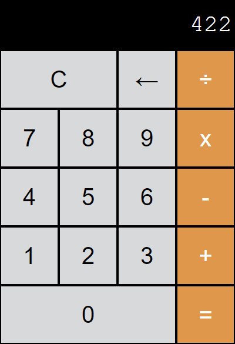

#### Calculator Exercise. Teacher Brian's calculator [is here](https://btholt.github.io/intro-to-web-dev-v2/calculator.html).

Created with this HTML hiearchy:

    

	    
0

	    
C

	    
←

	    
÷

	    ...
	    
1

	    
0

	    
=

    

#### Screenshot

